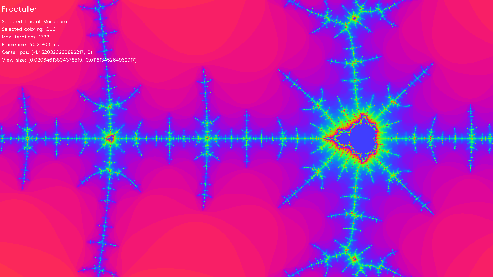
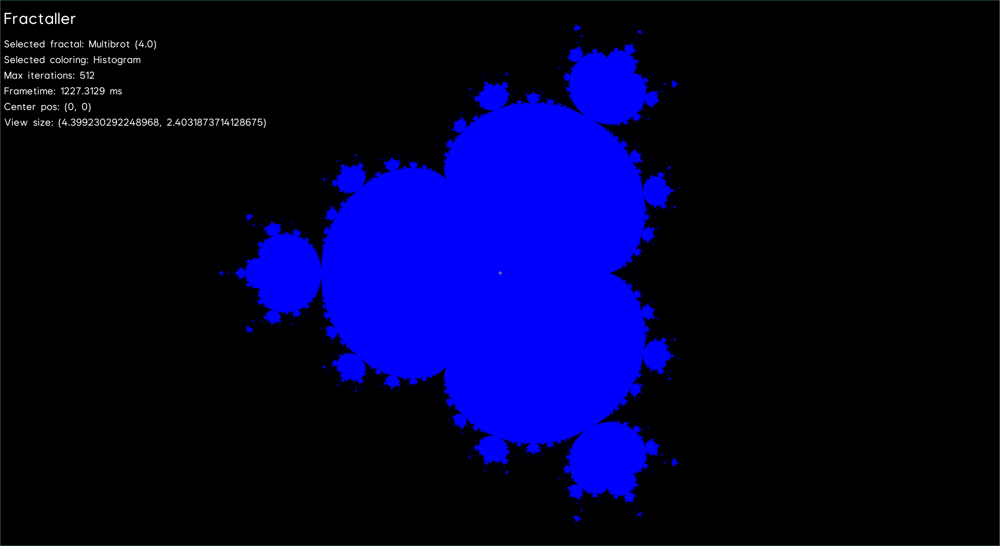

# [Fractl](https://shapur1234.github.io/Fractl/)

- Fractal renderer written in rust
- Singlethreaded, multithreading (using [rayon](https://github.com/rayon-rs/rayon)) and gpu compute (using [wgpu](https://github.com/gfx-rs/wgpu) - [WebGpu](https://developer.mozilla.org/en-US/docs/Web/API/WebGPU_API) implementation) versions
- Supports both native targets and [wasm](https://en.wikipedia.org/wiki/WebAssembly)
- Currently renders the [Mandelbrot set](https://en.wikipedia.org/wiki/Mandelbrot_set) and the [Multibrot set](https://en.wikipedia.org/wiki/Multibrot_set)

## Screenshots

## How to

- Try the [live demo](https://shapur1234.github.io/Fractl/) (Note: the web version runs on a signle thread without GPU acceleration, native version are much faster)
- Download a pre-build binary from [./bin](./bin)
- Run `cargo install fractl_gui` to install, optionally pick specific features (see "Building using cargo")

### Controls

| Key             | Action                                  |
| --------------- | --------------------------------------- |
| LeftMouseButton | Center view on cursor                   |
| WSAD            | Move view                               |
| R               | Reset view                              |
| ScrollWheel     | Increase / Decrease zoom                |
| O               | Increase zoom                           |
| P               | Decrease zoom                           |
| ArrowKey        | Increase / Decrease zoom in a direction |
| T               | Reset zoom                              |
| K               | Increase percision (max iterations)     |
| L               | Decrease percision (max iterations)     |
| M               | Next fractal                            |
| N               | Previous fractal                        |
| B               | Next fractal coloring                   |
| V               | Previous fractal coloring               |
| U               | Toggle UI                               |
| Y               | Toggle crosshair                        |
| C               | Increase exponent (for multi-fractals)  |
| X               | Decrease exponent (for multi-fractals)  |
| F11             | Toggle Fullscreen                       |
| Escape          | Exit                                    |

### Building using nix

- (This should be the most reliable way)
- Have [nix](https://nixos.org/) [installed](https://nix.dev/install-nix.html) on your system
- Pick a package

| Package                    | Description                               | Pararelism         | Floatin point percision |
| -------------------------- | ----------------------------------------- | ------------------ | ----------------------- |
| fractl_gui                 | Native gui                                | No                 | Double (f64)            |
| fractl_gui-multithread     | Native gui                                | CPU multithreading | Double (f64)            |
| fractl_gui-gpu             | Native gui                                | GPU compute shader | Single (f32)            |
| fractl_gui-wasm            | Web gui                                   | No                 | Double (f64)            |
| fractl_gui-win             | Native gui crosscompiled to Winows x86_64 | No                 | Double (f64)            |
| fractl_gui-win-multithread | Native gui crosscompiled to Winows x86_64 | CPU multithreading | Double (f64)            |
| fractl_gui-win-gpu         | Native gui crosscompiled to Winows x86_64 | GPU compute shader | Single (f32)            |

- To build: `nix build .#Package`
- To build and run locally: `nix run .#Package`
- Example: `nix run .#gui-gpu`

- Or use on of the build scripts in [./script](./script)

### Building using cargo

- Have [rust](https://www.rust-lang.org/tools/install) installed, or optionally use the included dev shelle: `nix develop`
- Pick feautres

| Feature    | Description                             | Notes                                                                       |
| ---------- | --------------------------------------- | --------------------------------------------------------------------------- |
| multithred | CPU multithreading                      | _multithread_ and _gpu_ cannot be enabled at the same time                  |
| gpu        | GPU computing                           | _multithread_ and _gpu_, _gpu_ and _f64_ cannot be enabled at the same time |
| f32        | Single percision floating point numbers | _f32_ and _f64_ cannot be enabled at the same time                          |
| f64        | Double percision floating point numbers | _f32_ and _f64_ cannot be enabled at the same time                          |

- To build: `cargo build --package=fractl_gui --no-default-features --release --features "Feature1 Feature2"`
- To run: `cargo run --package=fractl_gui --no-default-features --release --features "Feature1 Feature2"`
- Example: `cargo build --package=fractl_gui --no-default-features --release --features "gpu f32"`

## TODO

- Add Julia set, more fractals
- F128 floating point
- Wasm WebGpu with compute shader
- Redox port
